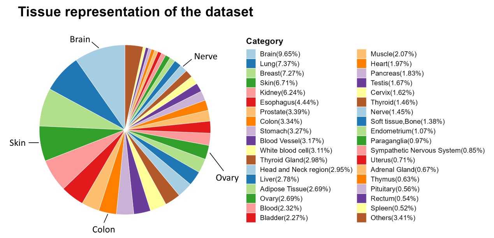

# Generative models for bulk RNA-Seq data
This repository is the Tensorflow implementation of the our paper "Generating bulk RNA-Seq gene expression data based on generative deep learning models and utilizing it for data augmentation". It contains the code for our model training and inference.

## Requirements
Our models are based on [Tensorflow for R](https://github.com/rstudio/tensorflow). The code was tested with R 4.2.2 and Python 3.9.13.
The required R packages listed as follows:
- Tensorflow 2.9+ ([Install in R](https://tensorflow.rstudio.com/install/))
- Keras 2.9+
- ggplot2 3.3.6+
- Rtsne 0.16+

## Usage
### Training
1. Preparing for bulk RNA-Seq gene expression data.
    - **TPM** normalization.
    - Save the expression matrix as `data.Rdata` in `Training` folder.  
        e.g. A matrix (1000,19797), `1000` mean the number of samples and `19797` mean the number of genes (protein coding genes).
2. Changing the hyperparameters.
3. Running `RNA-Seq GAN(min-max).Rmd` to start training.

### Inference
1. Placing the pre-trained model `generator` in the `Inference` folder.
2. Making sure that the `other.Rdata`, `generator` and `Inference.Rmd` are in the same directory.
3. Changing the parameters `primary_site` and `sample_type` in `Inference.Rmd`.
4. Running `Inference.Rmd` to generate specific samples. Results will be saved as `.Rdata`

    
  
  <em>The composition of the dataset for this model</em>

## Reference
- [Our paper](https://www.sciencedirect.com/science/article/pii/S0010482523012933)
- https://keras.io/examples/generative/wgan_gp/